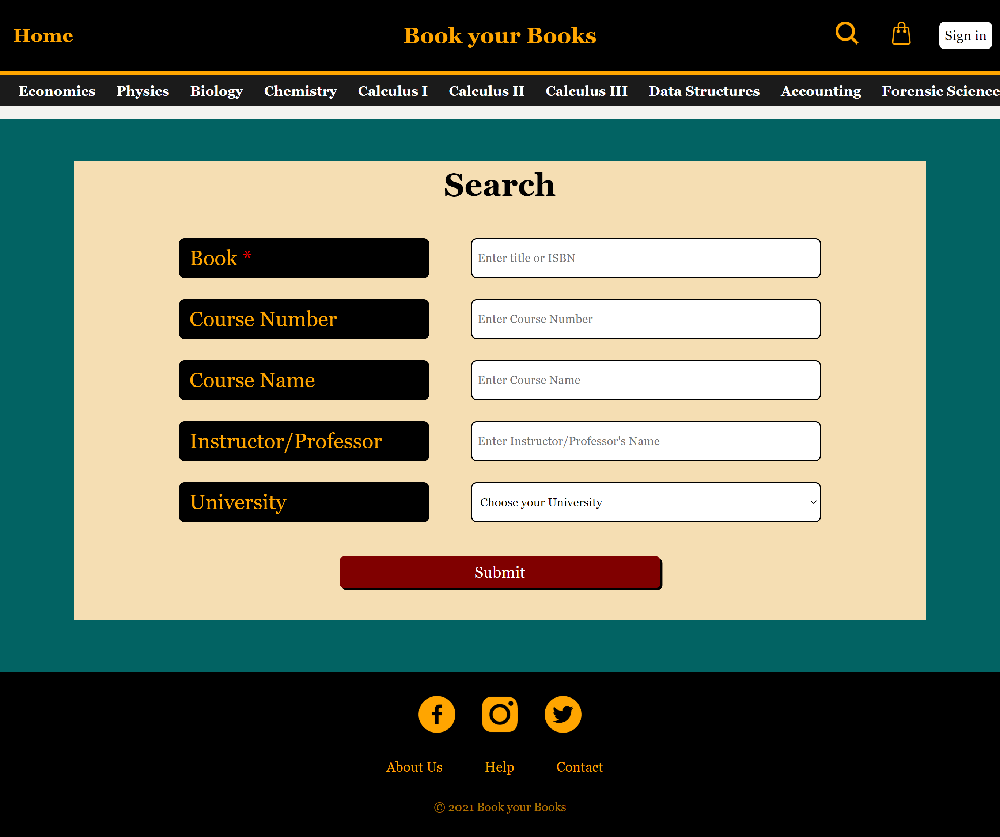

# Book your Books: Phase 2

"Book your Books" is a website that is being developed for students at the University of New Haven. Students will upload their used course books on the platform and current students who are enrolled in that particular course would be able to buy them. The website serves as a Client to Client communication platform where the buyer's information would be transferred to the seller, who would then communicate with the buyer directly.  

In Phase - 2, I designed and created the home page (header & footer), sign-in page, and search page. In the initial phase, I used raw HTML and CSS without any supporting framework to layout the design. In Phase - 2, I intend to integrate the CSS framework, Bootstrap, for responsive and fluid design. Furthermore, I intend to complete the home and courses page by adding the carousel. The carousel would allow the user to view the different books that are available for each course.  

## Home Page

## Search Page

## Sign Up Page

## Successful Sign Up & Login

## Sign In Page

## Successful Log In

## User Account Information 

## My Sellings (Sell Course Book)

## Successful Upload

## Recently Added Section (Home Page) after Upload

## Logout

## Responsiveness Website - Bootstrap

## Developer Information

Name: Muntasir Hossain  
Email: ahoss1@unh.newhaven.edu  

Computer Science junior majoring at the University of New Haven. Full Stack Developer with experience in HTML, CSS, JavaScript, EJS, Bootstrap, NodeJS, ExpressJS, and MongoDB 

